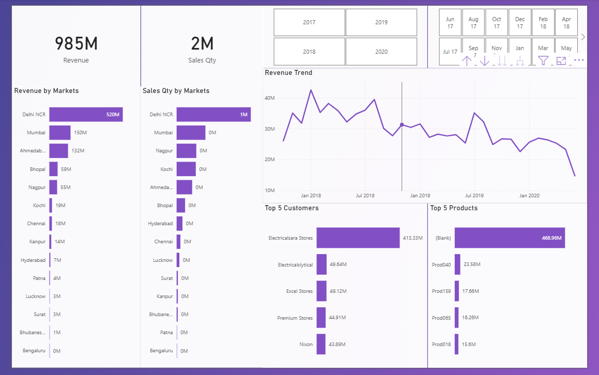

# Sales Dashboard – Power BI Project

## Problem Statement

Businesses struggle to track sales performance and identify key growth areas.

## Objective

* Analyze sales trends
* Identify top-performing products
* Improve decision-making

## Tools Used

* Power BI
* SQL

## Dataset

* Source: Dummy data
* Includes: sales, customers, products, markets, dates 

## Dashboard Preview

## Key Insights

* Sales decreased over the time period
* Certain regions are performing extremely well
* Top products contribute majority revenue

## Business Recommendations

* Focus on high-performing regions
* Improve low-performing products

## How to Use

1. Download `.pbix` file
2. Open in Power BI Desktop

## Project Files

* `/dashboard` → Power BI file
* `/data` → Dataset (sql)
* `/images` → Screenshots
